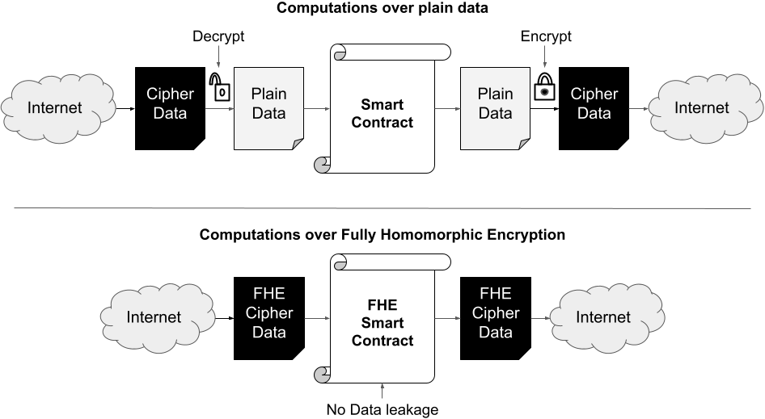

# Homomorphic encryption execution on the Varium C1100 FPGA

Employ reconfigurable FPGAs to execute the [Fully Homomorphic Encryption over the Torus (TFHE)](https://eprint.iacr.org/2018/421.pdf). In particular, the Fast Furrier Transform and Lagrange Multiplication.

### Disclaimer

To fully comprehend the terminology behind Homomorphic Encryption, requires a deep understanding of cryptography, signal processing, and mathematics. Nevertheless, thanks to the high-level libraries provided by Vitis, it is possible to abstract the most complicated parts of it.

The overall project might seem like a daunting task to grasp at first; however, it is possible to run the examples below without a full understanding of the inner details, even with a surprise a the end of this article.

Remember, it is not just about the destination, but about enjoying the journey to discovery.

### Background

On an everyday basis, everyone employs cryptography seamlessly: surfing the web using HTTPS, buying merchandise at a store using a credit card, or by sending messages in (Signal)[https://signal.org/en/]. At the core, these examples take advantage of the [Public Key Cryptography scheme (PKC)](https://en.wikipedia.org/wiki/Public-key_cryptography). PKC is also known as "Asymmetric Cryptography" because it employs a set of two (or more) keys to encrypt/decrypt data using public/private keys respectively. The image below shows an example of how PKC is used to transfer a message across an "insecure" channel, which in this case is the internet.

Blockchain implementations like Bitcoin, Ethereum, or Cardano employ the PCK principle extensively in their wallet functionality, where a user creates a public address (where funds are deposited) and the private key serves to sign transactions. Something most people do not realize is all transactions in those blockchains are public. In other words, the movement of funds between public addresses is visible to all participants in the network, which makes every move traceable and possibly identifiable to individuals. That applies as well to "smart contracts" on Ethereum, Cardano, or Solana, where all the transactions performed require "plain data" to operate.

A similar case occurs with public cloud services. Whenever a company uses its services (like AWS Lambda) the information transformation happens with clear data. For example, a user access a corporate site hosted on AWS, foreign communication happens over encrypted channels. However, the user's information needs to be decrypted to have it visible to the company as well as AWS, unless everything within the AWS servers is encrypted at every operation by the business, which in most cases is not true.

Therefore, in order to preserve the privacy of the transactions, data transformation and verifiable results with high confidence of no leakage of important information, Fully Homomorphic Encryption is the next step.

### ¿What is Fully Homomorphic Encryption?

Fully Homomorphic Encryption (FHE) is a peculiar cryptographic technique that carries out computations on encrypted data. This entitles a complete paradigm shift on data manipulation, user privacy, and blockchain services on the public internet.

As alluded to earlier, a generic application (ex AWS Lambda or a smart contract) receives encrypted data, first, it is necessary to decrypt the payload, perform the desired computations on the clear, and then re-encrypt the data. On the other hand, FHE removes the need to perform decryption-encryption at once. An example of this can be seen in the image below:

From the image, in the first case, all data received by the smart contract is received ciphered, then a decryption function obtains the original data, processes it in the smart contract and the results are encrypted to be sent to the recipient of that information. In the second case, thanks to FHE, the smart contract only needs to receive ciphered data, then apply all the necessary operations and output a still ciphered payload that can only be decrypted by the individual with the corresponding private key.

In the real world, when an app needs to execute a computation *F* on encrypted data, the FHE scheme proportionates an ***homomorphic*** computation *F'* that, once performed over the encrypted data, will be equivalent to the operation "decryption-encryption" required by current applications over clear data. In mathematical terms: F(clear_data) = Decrypt(F'(encrypted_data)).

The achievement of FHE could have a broad impact on society. It could transform the perspective on everyday computations with primordial end-to-end privacy. For example, FHE users would offload numeric-intensive calculations to cloud services with the certainty that the results would not be accessible by anyone but the private key owner. The same could be stated about public blockchains, where smart contracts execute all their operations over encrypted data without revealing the inputs-transaction-outputs.

The major drawback in the FHE adoption is its slow performance. Even though there is active research, computations over FHE encrypted data perform orders of magnitude slower than operations on plain data. In addition to that, app transformation from unencrypted data to FHE-enabled on encrypted payloads is not a trivial translation. When that translation is not properly engineered, it significantly increases the performance difference between computing on clear data and FHE encrypted data, diminishing the benefits of FHE adoption.

This [video](https://www.youtube.com/watch?v=5Mhbaeuv5fk) summarizes the impact FHE will have on multiple industries, like healthcare, finance, or airlines. Another example [video](https://www.youtube.com/watch?v=nlsd2LO-S50) shows the possibility of running a Linear Machine Learning model to calculate a prediction over encrypted data using FHE. This other [video](https://www.youtube.com/watch?v=487AjvFW1lk) reviews the FHE landscape.

### Fully Homomorphic Encryption over the Torus

Multiple implementations employ advanced mathematical techniques to comply with the FHE protocol. Research around this topic preceded four generations plus a Prelude stage that established the foundational technologies. This project focused on a particular implementation named ["Fully Homomorphic Encryption over the Torus (TFHE)"](https://tfhe.github.io/tfhe/). TFHE is a C/C++ framework that implements a very fast gate-by-gate bootstrapping with an open-source library that evaluates arbitrary boolean circuits composed of binary gates, over encrypted data, without revealing any information on the data.

Among its capabilities, the TFHE framework supports homomorphic evaluation of basic binary gates: AND, OR, XOR, NAND, NOR, NOT, MUX, XNOR. The foundational operation is named ["Gate-Bootstrapping"](https://eprint.iacr.org/2010/520). This process is necessary to reduce the amount of "noise" after applying multiple TFHE gates to ciphered data. The image below provides an example of this:

TFHE has no restriction on the number of gates or composition. Therefore, it can perform any computation over encrypted data, even if the applied function is unknown when data is encrypted. The library can operate with manually created circuits or automated circuit generation tools. This [video](https://www.youtube.com/watch?v=28XlccZgiUM) explains in detail the THFE algorithm.

### Project implementation

The focus of this project explored the execution of certain functions used by the TFHE library on the Varium C1100 FPGA board. As a background, TFHE is utilized by the NuCypher Blockchain project in two implementations [here](https://github.com/nucypher/nufhe) & [here](https://github.com/nucypher/TFHE.jl). These give this project a perspective projection into its future integration on a public blockchain.

Thanks to TFHE source code in C/C++ and Vitis HLS developer tools, this project offloaded processing to the Varium C1100. In particular, operations around the (Inverse) Fast Fourier Transform (FFT) and polynomial multiplications. Given the hackathon time constraints and the FHE algorithm understanding, only these operations deploy to the HLS kernel to reach the deadline with a product that takes advantage of the FPGA. Future work will deploy additional gates and employ a larger hardware footprint.

With an overview of the [TFHE github](https://github.com/tfhe/tfhe) structure:

[//]: <> (brew install gource ffmpeg)
[//]: <> (gource -720x480 --seconds-per-day 0.05 --auto-skip-seconds 0.01  -o - | ffmpeg -y -r 30 -f image2pipe -vcodec ppm -i - -vcodec libx264 -preset ultrafast -pix_fmt yuv420p -crf 1 -threads 0 -bf 0 gource.mp4)

https://youtu.be/aFW0Yi3MpQg

As shown earlier, TFHE needs to calculate a "bootstrap key" (BSK) to perform operations over encrypted data while keeping acceptable noise. Even though the BSK creation happens once, it is a time-consuming operation. This project focused its efforts on this execution into the FPGA provided by the need for FFT and fixed data length at the time of execution.

### FFT Kernel

The BSK creation requires the following operations: 

- IFFT over integer polynomials
- IFFT over torus polynomials
- Lagrange polynomial multiplications
- FFT over torus polynomials
- Torus polynomial summation

Despite their fancy names, they involve a lot of sums/multiplications and fixed-sized loops over complex and real numbers, which are excellent candidates to deploy on the Varium C1100 FPGA. Note: if you need a refresher on FFT, here is a [video](https://www.youtube.com/watch?v=toj_IoCQE-4) that quickly explains what it means and its importance in areas of communication and data analysis.

[Vitis HLS](https://www.xilinx.com/support/documentation/sw_manuals/xilinx2020_2/ug1399-vitis-hls.pdf) is a high-level synthesis tool that enables C/C++ to hardwire onto the device logic fabric and RAM/DSP blocks. This project exploits Vitis HLS to implement hardware kernels in the [Vitis IDE](https://www.xilinx.com/products/design-tools/vitis/vitis-platform.html) flow based on the TFHE C++ code.

### Implementation 

### Results

### Docker Deployment

### Challenges

Initially, the main trouble was to define the scope of "what to work on" for the hackathon. The first approach was the development of zero-knowledge proofs on the FPGA, however open source code (ex. [1](https://github.com/ZcashFoundation/zcash-fpga), [2](https://github.com/MinaProtocol/mina)) was hard to understand and difficult to decode towards a working prototype.

Afterward, another project related to blockchain arose on the developer's radar: [nucypher TFHE](https://github.com/nucypher/nufhe). Even though the code did not compile and was not testable, it provided the insights to deploy an FHE system onto the FPGA.

Fortunately, the TFHE repository bases its code in C/C++. Thanks to Vitis HLS, as a developer tool to translate code to hardware, it was possible to transfer FFT functions to a kernel that executes on the Varium C1100. This achievement was possible within a three month period. The main challenge was to test differences between software - hardware emulation, which behaved diffently when using static variables, a challenge of two weeks debugging.

Thanks to Hackster and Xilinx's support, this project deployed its bitstream in physical hardware and even a docker container. This step is critical in any hardware development. For example, software and hardware emulations compiled the kernels. However, when creating the xclbin to the Varium C1100, it could not compile because of library restrictions. Nevertheless, after many other challenges, the project reached a deliverable stage.

### Conclusion

This project is a precursor to the full deployment of TFHE circuits on reconfigurable hardware. The execution of FFT/polynomial operations only scratches the surface of the potential this line of research has for private computations in the cloud and public blockchains. 

Even though the initial results might not be impressive, the fact that Vitis HLS simplified code translation from a dynamic memory to a static-length circuit environment within the time constraints of this hackathon is an achievement in itself. 

Despite Vitis' excellent support for software/hardware emulation, tests on real hardware are fundamental to align the project's objectives and its execution.

### Future work

This project shows how to deploy C++ code to an FPGA. The steps necessary to take this project to the next level could involve the following:
 
 - Seek to increase the number of functions that execute concurrently on hardware.
 - Deploy TFHE fixed circuits in hardware
 - Exploit partial reconfiguration to replace TFHE circuits on demand

 There are multiple [practical applications of FHE](https://www.youtube.com/watch?v=YLbED9OexOY), once FHE becomes more relevant in the blockchain and cloud applications, Xilinx FPGA would be well-positioned to be the reference hardware in the deployment of these payloads.

### Acronyms
- FHE: Fully Homomorphic Encryption
- TFHE: FHE over the Torus
- FPGA: Field Programmable Gate Array
- CPU: Central Processing Unit
- GPU: Graphics Processing Unit
- GPGPU: General Purpose GPU
- ALU: Arithmetic Logic Unit
- DSP: Digital Signal Processor
- HBM: High Bandwidth Memory
- LUT: Look-Up Table
- OCL: Open Compute Language (OpenCL)
- CU: Compute Unit
- SW: Software
- HW: Hardware
- PCI Express (PCI-E): Peripheral Component Interconnect Express
- MUX: Multiplexor
- FFT: Fast Fourier Transform
- iFFT: Inverse FFT
- IDE: Integrated Development Environment

### Bio
Ph.D. rval735 is a programmer based in Auckland, New Zealand. He focuses his research on Binary Neural Networks. This project serves as the first brick to construct a bridge between blockchain technologies and Artificial Neural Networks.

He is very passionate about topics around BNN, Blockchain, and FPGA acceleration and looks forward to taking better advantage of reconfigurable hardware to make public ledger networks more efficient.

If you would like to contribute to his projects in any possible way, visit the GitHub repository, check his crypto address if you would like help with anything that you can 😉.