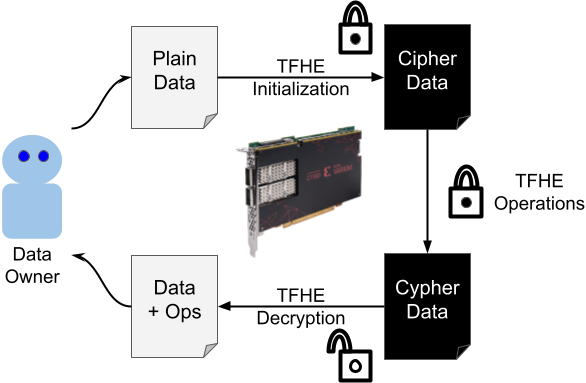

# Homomorphic encryption execution on the Varium FPGA

This project employs the [Xilinx Varium C1100](https://www.xilinx.com/products/accelerators/varium/c1100.html) reconfigurable FPGA to execute the Fully Homomorphic Encryption operations over the Torus (TFHE), in particular the Fast Furrier Transform and Lagrange Multiplication.

This development is part of the [Adaptive Computing Developer Contest 2021 by Xilinx](https://www.hackster.io/contests/xilinxadaptivecomputing2021/). The entry is explained in this [link.](https://www.hackster.io/rval735/acceleration-of-homomorphic-encryption-with-xilinx-fpga-24d550) as well as the file [Competition Entry](CompetitionEntry/CompetitionEntry.md) within this repository

### Overview

The image below provides a high-level overview of the system architecture.



### Code structure

It contains four distinctive sections:
- Bitstream: The compiled xclbin file that deploys to the FPGA
- CompetitionEntry: Folder with images and description on what was done for this project
- fpga-tfhe: The CPU code that initializes and connects to the FPGA
- fpga-tfhe_kernels: Where the HLS code lives, once compiled, it executes on the FPGA
- fpga-tfhe_system: The link that helps to bridge kernels and the CPU execution
- fpga-tfhe_hw_link: A "prj" that links the hardware compilation to the "fpga-tfhe_system" project
- Vitis_Libraries: submodule reference to the Vitis library at commit 4bd100518

### Hardware Requirements

- The author used a desktop computer i5 6th gen, 16GB Ram and 1TB SSD
- A PCIe connected [Xilinx Varium C1100](https://www.xilinx.com/products/accelerators/varium/c1100.html) (provided by the hackster competition). It is possible to execute this project on the Alveo U50 as well.

### Software Requirements

- Ubuntu 21.04 (or Windows 10)
- [Vitis 2021.2 IDE](https://www.xilinx.com/support/download/index.html/content/xilinx/en/downloadNav/vitis.html)
- [Vitis DSP Library](https://xilinx.github.io/Vitis_Libraries/dsp/2020.1/index.html) (git dependency).

### Install

The contents in this repository should be sufficient to recreate a Vitis project.

### Binaries

This project includes the bitstream compiled for the Varium C1100 FPGA and the corresponding XRT enabled CPU executable. This was compiled using Vitis 2021.2.1 in Ubuntu 21.04. To execute it, simply reference them from the Bitstream folder:

```
./fpga-tfhe PolyKernel.xclbin
```

This will execute the BSK on the FPGA and then 100 circuits with that bootstrap key.

### Docker Deployment

This project has a docker file that allows users to create their image using the bitstream and compiled binary to run the executable example. The following example code helps to perform such task:

```
## Create the image from the Dockerfile located in the FPGA-TFHE repository
docker build -t VariumC1100-TFHE .

## Run container with a link to the device 
DEVICE="--device=/dev/xclmgmt256:/dev/xclmgmt256 --device=/dev/dri/renderD128:/dev/dri/renderD128"
docker run --name xillTest --rm -t -i $DEVICE VariumC1100-TFHE bash
```

### License

This project bootstrapped from the original TFHE implementation found [here](https://github.com/tfhe/tfhe). That code uses Apache 2 License, while new additions in this project employ the license GPL 3. If there are doubts about it, check on the top of each file to find the corresponding license.
